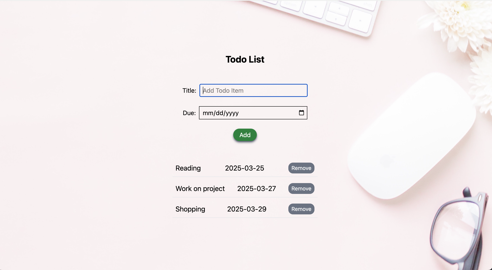

# CodeAlpha Task 2 TO DO LIST

## Task description

Create a To-Do List web application using HTML, CSS, and JavaScript. Users can easily create, save, and organize their daily tasks. This app simplifies task management and provides a convenient way to track and prioritize tasks.

## GIF

## Installed the following:
- npm install tailwindcss @tailwindcss/vite</li>
- npm install prop-types<li>

Copyright [2025] [Sisi Wang]

Licensed under the Apache License, Version 2.0 (the "License");
you may not use this file except in compliance with the License.
You may obtain a copy of the License at

    http://www.apache.org/licenses/LICENSE-2.0

Unless required by applicable law or agreed to in writing, software
distributed under the License is distributed on an "AS IS" BASIS,
WITHOUT WARRANTIES OR CONDITIONS OF ANY KIND, either express or implied.
See the License for the specific language governing permissions and
limitations under the License.

